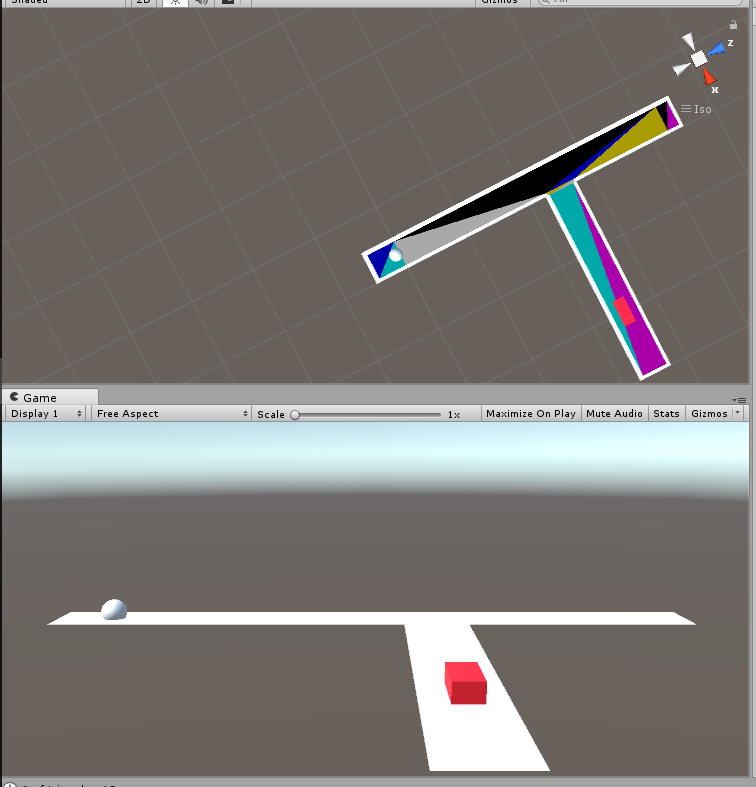

# triangulation

This is for testing the triangulation of NavMesh.

# pre-required package
In order to use Json on the top of the unity, install the following package:
https://github.com/SaladLab/Json.Net.Unity3D

Json.Net.Unity3D 9.0.1 version was tested: https://github.com/SaladLab/Json.Net.Unity3D/releases/download/v9.0.1/JsonNet.9.0.1.unitypackage

After downloading the above package, click it. Then it will be automatically installed into the opened project in the unity.

# Json Content
The test code (Program.cs) will write a json file (which names triangulation.json) with the content as followings:

  {"vertices":{"0":[56.6666679,0.8333333,0.0],"1":[95.0,0.8333333,0.0],"2":[95.0,0.8333333,-43.3333321],"3":[56.6666679,0.8333333,-43.3333321],"4":[56.6666679,0.8333333,426.666656],"5":[95.0,0.8333333,426.666656],"6":[95.0,0.8333333,275.0],"7":[95.0,0.8333333,226.666656],"8":[95.0,0.8333333,0.0],"9":[56.6666679,0.8333333,0.0],"10":[56.6666679,0.8333333,426.666656],"11":[100.0,0.8333333,270.0],"12":[395.0,0.8333333,270.0],"13":[395.0,0.8333333,231.666656],"14":[100.0,0.8333333,231.666656],"15":[95.0,0.8333333,226.666656],"16":[56.6666679,0.8333333,426.666656],"17":[95.0,0.8333333,275.0],"18":[100.0,0.8333333,231.666656],"19":[100.0,0.8333333,231.666656],"20":[95.0,0.8333333,275.0],"21":[100.0,0.8333333,270.0],"22":[95.0,0.8333333,426.666656],"23":[56.6666679,0.8333333,426.666656],"24":[56.6666679,0.8333333,445.0],"25":[95.0,0.8333333,445.0]},"triangles":{"0":[0,1,2],"1":[0,2,3],"2":[4,5,6],"3":[7,8,9],"4":[7,9,10],"5":[11,12,13],"6":[11,13,14],"7":[15,16,17],"8":[15,17,18],"9":[19,20,21],"10":[22,23,24],"11":[22,24,25]}}

